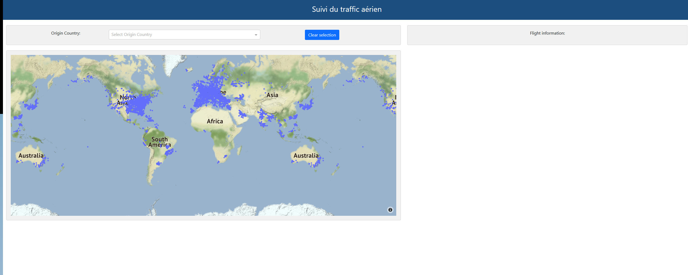

# Suivi du traffic aérien
- Suivi en temps réel du traffic aérien
- Analyse des données des historiques des vols

## Revue sur le contenu

La branche contient 8 répertoires dont le repertoire **documentation**, le repertoire **images** contenant les figures utilisées dans ce readme et les autres repertoires contenant :

- Un ou plusieurs scripts Python permettant la configuration et/ou le chargement du container portant le nom de ce répertoire.
- Un fichier "requirements.txt" contenant les dépendances nécessaires pour la bonne exécution de ces scripts.
- Un Dockerfile créant une image Python qui exécute les scripts de configuration et/ou de chargement des conteneurs docker.
- Dans certains cas, des fichiers complémentaires facilitant le paramètrage et/ou l'exploitation des containers construits.


### Présentation des répertoires

a. **documentatin**: contient un fichier de documentation concernant l'architecture de stockage adoptée et un fichier contenant les slides utilisées pour présenter notre application

b. **images**: contient les figures utilisées dans ce readme

c. **Elasticsearch**:

* Créer 3 indexes : flights, airports, companies, flights_enriched
* Enrichir les données de flights avec celles contenues dans companies et airports pour les insérer dans flights_enriched (init_kibana.sh):
  - Configuration et exécution des pipelines de jointures
  - Réindexation des données au bon format
* Charger un dashboard préconçu permettant d'analyser les données des 3 indexes dans Kibana (init_kibana.sh)

d. **MongoDB**: pour créer et charger la base de données MongoDB à partir des requêtes envoyées à l'api OpenSky

e. **mysql** :

* Créer et charger la base de données Mysql. Ce dossier contient les scripts du scrapping HTML des données des aéroports.
* Les données sont extrtaites de ce site: https://www.world-airport-codes.com

f. **Dash** : pour créer une map contenant les positions des avions en temps réel en utilisant les données stockées dans la base mongodb

g. **Logstash**

* Créer un pipeline pour charger mensuellement la table aéroports contenue dans la base de données du container MySQL vers l'index airports
* Créer un pipeline pour charger mensuellement la table compagnies contenue dans la base de données du container MySQL vers l'index companies

h. **Airflow**: Pour automatiser l'extraction des données et le chargement dans les bases: mysql, elasticsearch et mongodb. Il s'agit d'automatiser la partie ETL (Extract Transform Load) et de définir un DAG (Directed Acyclic Graph) pour chaque base.

Les Dags définis dans Airflow sont:

1.  Le dag mysql pour l'automatisation de la mise à jour de la table "Aeroport" dans MySQL. Il s'exécute une fois par mois: 

<p align="center">
  
</p>


2.  Le dag Elasticsearch pour l'automatisation du remplissage d'elasticsearch. Il s'exécute tous les jours à 8h du matin:

<p align="center">
  
</p>

3.  Le dag MongoDB pour l'automatisation du remplissage de la base MongoDB. Il s'exécute toute les 45 seconces:

<p align="center">
  
</p>


### Présentation du Docker-compose.yaml

Le Docker-compose.yaml gère et regroupe toutes les images des services nécessaires pour ce projet. Les images sont:

1. mongo: image de la base de données mongoDB
2. mongo_load: image python qui initialise la base mongoDB
3. mongoexpress: image. 
RQ: Les services mongo_load et mongoexpress dépendent du service mongo.
4. elasticsearch: image de la base de données Elasticsearch
5. es_load: image python qui permet d'initialiser la base Elasticsearch.
6. kibana: image de l'interface utilisateur qui nous permet de visualiser les données Elasticsearch
RQ: Le lancement des services es_load et kibana dépendent du service Elasticsearch.
7. mysql: image de la base de données mysql. dans le volume, on a définit le schema.sql pour créer la base et les deux tables. 
8. python-mysql: image python qui permet de scrapper les données et les charger dans mysql. 
9. logstash: image Logstash qui copie les données de MySQL à Elasticsearch
10. Dash: image python qui utilise dash pour visualiser les positions des avions en temps réel.
  
  Les volumes utilisés pour les bases de données sont dynamiques et gérés entièrement par docker. C'est pour quoi on a définit le service  "volumes".


## Démarrage
- Lancer le projet (tous les conteneurs nécessaires), en éxécutant la commande suivante dans un terminal linux:

```bash
./setup.sh
```
Le lancement des conteneurs et l'initialisation prend entre 20 et 30 minutes.
Une fois le lancement est terminé et logstash fini tous les ETLs, vous pouvez passer à la suite.

- Ouvrer un deuxième terminal

- Lancer les dags airflow, en accédant d'abord au conteneur airflow :
```bash
docker exec -ti dst-airlines_airflow-scheduler_1 bash
```
PS: Il se peut que votre serveur airflow s'appelle plutôt: dst-airlines-airflow-scheduler-1, dans ce cas utiliser ce nom au lieu de dst-airlines_airflow-scheduler_1 dans la commande précédente.


- Une fois à l'intérieur du conteneur airflow, il s'agit de lancer les trois dags permettant l'automatisation du remplissage des bases de données.
```bash
# activer le dag associé au remplissage de la base mysql
airflow dags unpause mysql_dag
# lancer le dag associé au remplissage de la base mysql
airflow dags trigger mysql_dag
# activer le dag associé au remplissage de la base mongodb
airflow dags unpause my_mongo_db_dag
# lancer le dag associé au remplissage de la base mongodb
airflow dags trigger my_mongo_db_dag
# activer le dag associé au remplissage de la base elasticsearch
airflow dags unpause my_elastic_search_dag
# lancer le dag associé au remplissage de la base elasticsearch
airflow dags trigger my_elastic_search_dag
```
- Quitter le conteneur airflow
```bash
exit
```

- Lancer le script (depuis la racine) qui permet l'enrichissement des données elasticsearch et le chargement du dashbord dans kibana (cette opération peut prendre 5 minutes)
```bash
./elasticsearch/init_kibana.sh
```

- Pour suivre le traffic en temps réel (en utilisant dash), allez à l'URL http://localhost:8050/
<p align="center">

 
</p>

- Pour analyser des données des historiques des vols, allez à l'URL http://localhost:5601/app/dashboards, puis cliquer sur le dashbord nommé "DST Airlines 2.0"

<p align="center">
  
</p>

                 
## Accès aux bases de données:

- Accès à mongoDB: se rendre sur le lien http://127.0.0.1:8081/ 
- Accès à Elasticsearch: se rendre sur le lien http://localhost:5601/ --> Ouvrir la console Dev Tools --> Exécuter les requêtes "GET flights/_search" , "GET /flights_enriched/_search", GET /airports/_count, GET /companies/_count, etc.
- Accès à mysql: installer un client en local (dbeaver par exemple), le paramétrer et exécuter des requêtes SQL classiques. 
